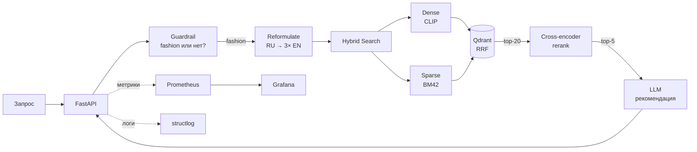

# Multimodal Fashion RAG

Мультимодальный поиск по fashion-каталогу: русские запросы → англоязычные товары, поиск по тексту и по картинке, LLM-консультант с follow-up подсказками. Observability через Prometheus + Grafana, тесты и CI.

[](https://github.com/EthernalSolitude/multimodal-fashion-rag/actions/workflows/ci.yml)       

---

## Ключевые особенности

- **Гибридный поиск** (dense CLIP + sparse BM42 + cross-encoder rerank) — **P@5 = 0.934 [0.904, 0.960]** на 100-query benchmark с bootstrap 95% CI, **+43% над dense-only** baseline (статистически значимо, non-overlapping CI)
- **LLM переформулирует запрос** в несколько фраз → fan-out поиск → cross-encoder ранжирует общий список — помогает на нечётких запросах типа «что-нибудь для зала»
- **Guardrail** — LLM проверяет что запрос про одежду, отказывает на off-topic («расскажи про погоду»), кэширует результат
- **Observability** — структурированные JSON-логи со сквозным `request_id`, Prometheus-метрики по каждой стадии пайплайна, готовый Grafana-дашборд
- **Redis shared cache** для повторяющихся LLM-запросов (guardrail и переформулировка), fail-open паттерн — сервис работает и без Redis
- **Rate limiting** через Redis (fixed-window, по IP) для тяжёлых LLM-эндпоинтов; защита от злоупотреблений с возвратом 429 + `Retry-After`
- **Conversational mode на LangGraph** — мультитёрный диалог с persisted-сессией в Redis, граф из 3 нод с условным роутингом (`analyze → search_and_respond / decline`)
- **90 автоматических тестов** (~10 сек, без GPU и БД, **coverage 82%**), **CI/CD на GitHub Actions** — линтер, тесты и автоматическая публикация Docker-образа в [GitHub Container Registry](https://github.com/EthernalSolitude/multimodal-fashion-rag/pkgs/container/multimodal-fashion-rag) на каждый push в main
- **Один `docker compose up --build`** поднимает всё: API, Qdrant, Redis, Prometheus, Grafana — или `docker pull ghcr.io/ethernalsolitude/multimodal-fashion-rag:latest`

---

## Демо

```
Запрос:  "синяя рубашка для мужчин"
   │
   ├─ LLM reformulate → ["blue shirt men", "navy mens top", "men casual blue shirts"]
   │
   ├─ Fan-out по 3 подзапросам + оригиналу:
   │    ├─ Dense (CLIP-multilingual) → top-20
   │    └─ Sparse (BM42) → top-20
   │       ↓ Reciprocal Rank Fusion
   │    Union кандидатов ≈ 50 товаров
   │
   ├─ Cross-encoder rerank (mmarco-mMiniLMv2 multilingual) → top-5
   │
   └─ LLM recommendation: pick + reason + 3 follow-up suggestions
```

---

## Как работает поиск (по шагам)

1. **Guardrail** — LLM проверяет: запрос вообще про одежду? Если нет («расскажи про погоду») — отказ с вежливым объяснением, поиск не запускается. Результат кэшируется, чтобы не дёргать API на повторах.
2. **Reformulate** — LLM превращает русский запрос в 3 короткие английские фразы-синонимы (каталог на английском). Пример: «синяя рубашка для мужчин» → `["blue shirt men", "navy mens top", "men casual blue shirts"]`.
3. **Hybrid search** — по каждой фразе параллельно ищем в Qdrant двумя способами:
   - **Dense** — CLIP-эмбеддинг, ищет по семантическому смыслу
   - **Sparse (BM42)** — ищет по редким токенам и точным совпадениям (бренды, артикулы)
   - **RRF (Reciprocal Rank Fusion)** — Qdrant сам объединяет два рейтинга в один. Это делается нативно через `FusionQuery`, не руками.
4. **Rerank** — собираем ~50 кандидатов со всех подзапросов, cross-encoder (мультиязычный) пересчитывает релевантность точнее чем векторный поиск, оставляем топ-5.
5. **LLM recommendation** — модель получает топ-5 и возвращает JSON: лучший товар, почему он подходит, альтернативы, 3 follow-up вопроса для уточнения.



**Про поиск по картинке:** текстовая CLIP-модель и image-CLIP работают в общем векторном пространстве, поэтому картинку и текст можно искать в одном индексе без отдельной базы для изображений.

---

## Метрики

Eval-харнесс с **bootstrap 95% CI** (1000 ресэмплов) на фиксированном test-set из **100 категориальных запросов** — `{Color} {Category} for {Gender}`. Ground truth: товары, совпадающие по всем трём фасетам. Test-set заморожен в `eval_data/test_queries.json` для воспроизводимости между прогонами.

| Конфиг                       | P@5                       | R@10                      | NDCG@10                   | MRR@10                    |
|------------------------------|---------------------------|---------------------------|---------------------------|---------------------------|
| BM25 sparse only             | 0.894 [0.856, 0.926]      | 0.935 [0.907, 0.960]      | 0.920 [0.891, 0.945]      | 0.940 [0.910, 0.970]      |
| Dense CLIP only              | 0.654 [0.592, 0.720]      | 0.646 [0.590, 0.703]      | 0.661 [0.606, 0.716]      | 0.813 [0.749, 0.870]      |
| Hybrid RRF                   | 0.806 [0.764, 0.844]      | 0.862 [0.826, 0.895]      | 0.848 [0.813, 0.880]      | 0.946 [0.913, 0.977]      |
| **Hybrid + cross-encoder rerank** | **0.934 [0.904, 0.960]** | **0.961 [0.938, 0.979]** | **0.955 [0.933, 0.973]** | **0.978 [0.953, 0.995]** |

**Что означают цифры:**

- **Полный пайплайн лучший на всех 4 метриках**: P@5 = 0.934 [0.904, 0.960]. Non-overlapping CI с dense-only baseline (0.654 [0.592, 0.720]) подтверждает статистическую значимость улучшения (+43% P@5).
- **Cross-encoder rerank — главный лифт качества**: +12pp P@5 над голым hybrid'ом, +8pp NDCG@10.
- **Любопытный нюанс**: на прямых categorical-запросах **BM25 alone сильнее голого hybrid'а** (P@5 0.894 vs 0.806) — sparse идеально матчит keywords, dense на таких прямых запросах добавляет шума. Это инсайт, который скрыт в single-metric eval'е.
- Полный отчёт: [`eval_data/results.md`](eval_data/results.md). Сырые данные: [`eval_data/results.json`](eval_data/results.json).

Запуск eval:
```bash
python eval_full.py                # использует фиксированный test-set, иначе создаёт
python eval_full.py --regenerate   # пересоздать test-set
```

---

## Стек

| Слой               | Технология                                        |
|--------------------|---------------------------------------------------|
| Web framework      | FastAPI (async) + Pydantic                        |
| Vector DB          | Qdrant (named vectors: dense + sparse, RRF native)|
| Dense embeddings   | `sentence-transformers/clip-ViT-B-32-multilingual`|
| Image embeddings   | `clip-ViT-B-32` (общее CLIP embedding-space)      |
| Sparse embeddings  | BM42 (`Qdrant/bm42-all-minilm-l6-v2-attentions`)  |
| Reranker           | `cross-encoder/mmarco-mMiniLMv2-L12-H384-v1`      |
| LLM                | OpenAI-compatible (Cerebras / Groq / OpenAI / Ollama) |
| LLM cache          | Redis (shared cache для guardrail + reformulate, fail-open) |
| Rate limiting      | Redis fixed-window per IP (fail-open), 429 + Retry-After |
| Conversational     | LangGraph (3-node graph, conditional routing) + Redis session state |
| Observability      | Prometheus + Grafana + structlog (JSON)           |
| Tests              | pytest + pytest-mock + pytest-cov (90 тестов, coverage 82%) |
| Eval               | Frozen test-set (100 queries) + bootstrap 95% CI + 4 baselines |
| CI/CD              | GitHub Actions (ruff + pytest + Docker → GHCR)    |
| Orchestration      | Docker Compose                                    |

---

## Quickstart (Docker Compose)

Требования: Docker Desktop, ~15 GB свободного места (модели + датасет).

```bash
# 1. Подготовка
cp .env.example .env            # впиши LLM_API_KEY
python download_models.py       # скачает CLIP + reranker + BM42 в ./models/

# 2. Данные (первичная индексация — один раз)
docker-compose up -d qdrant
python build_index.py           # скачает Fashion dataset и проиндексирует в Qdrant

# 3. Полный запуск
docker-compose up --build -d    # первый build ~10-15 мин (torch/transformers)
```

Сервисы после старта:

| Что              | URL                               |
|------------------|-----------------------------------|
| API + UI         | http://localhost:8000/            |
| API docs         | http://localhost:8000/docs        |
| Prometheus       | http://localhost:9090/            |
| Grafana          | http://localhost:3000/ (admin/admin) |
| Qdrant dashboard | http://localhost:6333/dashboard   |

---

## Dev-режим (без пересборки образа)

Compose монтирует `.:/app` и запускает `uvicorn --reload`. Правки любого `.py` подхватываются мгновенно без `docker-compose build`. Чтобы итерироваться ещё быстрее:

```bash
docker-compose up -d qdrant prometheus grafana
python api.py                   # API нативно → Prometheus скрейпит через host.docker.internal:8000
```

---

## API

### POST `/search`
```json
{
  "query": "синяя рубашка для мужчин",
  "top_k": 5,
  "color": "Blue",
  "gender": "Men",
  "rerank": true,
  "reformulate": true,
  "guardrail": true,
  "with_llm": true
}
```

Ответ:
```json
{
  "query": "синяя рубашка для мужчин",
  "subqueries": ["синяя рубашка для мужчин", "blue shirt men", "navy mens top"],
  "recommendation": {
    "pick": "Flying Machine Men Check Blue Shirts",
    "reason": "...",
    "alternatives": "...",
    "suggestions": ["Бренд: Flying Machine или Spykar?", "..."]
  },
  "products": [ {"score": 0.87, "title": "...", "image_url": "..."} ]
}
```

### POST `/search/image`
`multipart/form-data` с полем `file` (JPEG/PNG) — поиск по содержимому картинки через CLIP.

### GET `/metrics`
Prometheus text format. Scraped каждые 10 сек.

### GET `/health`, GET `/filters`
Health-check + список доступных значений для фильтров (кеш at startup).

---

## Observability

**Structured logs** (каждая стадия пишется с `request_id`):
```json
{"event":"stage_complete","stage":"hybrid_rrf","duration_ms":67.3,"request_id":"a3f2...","timestamp":"..."}
{"event":"stage_complete","stage":"rerank","duration_ms":125.4,"request_id":"a3f2..."}
{"event":"stage_complete","stage":"llm_generate","duration_ms":890.1,"request_id":"a3f2..."}
{"event":"request","path":"/search","duration_ms":1087.9,"status":"ok","request_id":"a3f2..."}
```

**Prometheus metrics:**

| Метрика                              | Тип        | Labels                    |
|--------------------------------------|------------|---------------------------|
| `search_duration_seconds`            | histogram  | `stage` (dense/sparse/rerank/llm_*) |
| `search_requests_total`              | counter    | `endpoint`, `status`      |
| `llm_errors_total`                   | counter    | `type` (rate_limit/guardrail/generate) |
| `guardrail_rejections_total`         | counter    | `reason`                  |

**Grafana dashboard** (`monitoring/grafana/dashboards/fashion-rag.json`) подгружается автоматически через provisioning — 5 панелей: latency p50/p95/p99 по стадиям, request rate, error rate, LLM errors, latency heatmap.

---

## Тестирование и CI/CD

```bash
pip install -r requirements-dev.txt
pytest --cov=.                  # 41 тест, ~1.7 сек, coverage 73%
ruff check .                    # линтер
```

**Что покрыто:** HTTP-эндпоинты через FastAPI TestClient (health, filters, search с guardrail), guardrail-логика (пропуск/отказ/кеш/fail-open), reformulate, обработка пустого результата от LLM, построение фильтров Qdrant, определение языка запроса, сворачивание score в итоговый dict, санитизация входных фильтров, валидация pydantic-моделей, observability-хелперы.

Тесты не поднимают настоящие модели и Qdrant — заменяют их заглушками. Поэтому весь прогон ~1.7 сек и не требует GPU, интернета или запущенной БД. Живую интеграцию проверяет `docker compose up`.

**GitHub Actions** (`.github/workflows/ci.yml`) на каждом push/PR автоматически:
1. Поднимает чистую Linux-машину
2. Ставит зависимости
3. Прогоняет линтер (`ruff`)
4. Прогоняет тесты с измерением coverage (порог 60%)
5. На push в main — собирает Docker-образ и пушит в GitHub Container Registry с тегами `latest` и `<git-sha>`

Готовый образ можно запустить без клонирования:
```bash
docker pull ghcr.io/ethernalsolitude/multimodal-fashion-rag:latest
```

Результат виден галочкой ✅ или крестиком ❌ рядом с коммитом.

---

## Структура проекта

```
.
├── api.py                      FastAPI endpoints, async, middleware
├── search.py                   Hybrid search + rerank + multi-query
├── llm.py                      LLM reformulate, guardrail, structured recommendation
├── observability.py            structlog + Prometheus metrics
├── build_index.py              Индексация датасета в Qdrant (dense + sparse)
├── download_models.py          Прекачать модели в ./models/
├── eval.py                     Synthetic eval на категориальных тройках
├── eval_diverse.py             LLM-judged eval с разнородными запросами
│
├── static/index.html           Простой UI
├── tests/                      pytest + conftest со стабами
├── monitoring/
│   ├── prometheus.yml          scrape config
│   └── grafana/
│       ├── dashboards/         JSON дашборды (автоподгрузка)
│       └── provisioning/       datasources + dashboard provider
│
├── docker-compose.yml          qdrant + app + prometheus + grafana
├── Dockerfile
├── pyproject.toml              pytest + ruff config
├── requirements.txt
└── requirements-dev.txt
```

---

## Архитектурные решения

**Почему Qdrant, а не FAISS / pgvector?** Qdrant из коробки умеет hybrid-поиск: держит dense и sparse векторы в одной коллекции и сам объединяет рейтинги через RRF. В других решениях пришлось бы мержить результаты двух отдельных индексов руками.

**Почему CLIP-multilingual?** Текстовая модель (включая русский) и картиночная CLIP живут в общем векторном пространстве — поэтому и текст, и картинку можно искать в одном индексе, без отдельной базы для изображений.

**Почему BM42, а не классический BM25?** BM42 использует веса трансформера вместо IDF и лучше работает на коротких текстах (название товара), не требует токенизации и подготовки корпуса.

**Почему мультиязычный reranker?** Стандартный `ms-marco-MiniLM` умеет только английский — на русском запросе выдавал нулевые score. Замена на `mmarco-mMiniLMv2` (14 языков) решила проблему без переизобретения пайплайна.

**Почему guardrail не блокирует при ошибке?** Если LLM-классификатор временно недоступен, вежливее пропустить запрос, чем показать пользователю «сервис не работает». Все сбои при этом считаются в метрике `llm_errors_total{type="guardrail"}` — видно в Grafana когда система деградирует.

**Почему в тестах заглушки, а не живые зависимости?** Тесты за 0.6 сек можно запускать на каждое сохранение файла. Поднимать Qdrant и скачивать 2 GB моделей ради unit-теста — медленно и ненадёжно в CI. Настоящая интеграция проверяется одним `docker-compose up`.

---

## Ограничения / что можно улучшить

- **Rerank на synthetic eval не улучшает метрики** — ground truth задан по тем же полям что и filters. На fuzzy-запросах (`eval_diverse.py`) прирост должен быть заметнее.
- **Нет персонализации и A/B** — для реального прода добавился бы userId, контекстный ре-ранк, experiments framework.
- **Нет кеша LLM-ответов** — одинаковые запросы каждый раз идут в API. Простое решение: Redis + lru_cache на структурированных ключах.

---

## Лицензия

MIT
